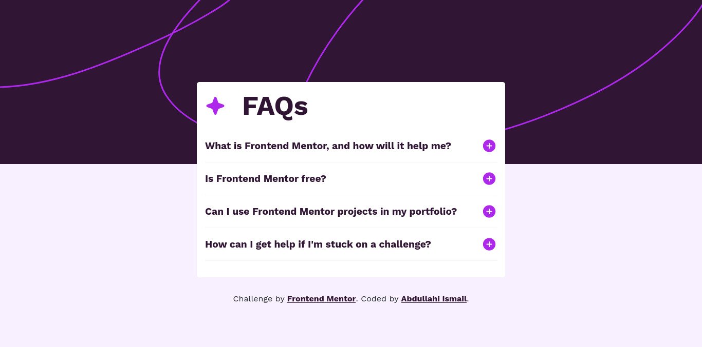

# Frontend Mentor - FAQ accordion solution

This is a solution to the [FAQ accordion challenge on Frontend Mentor](https://www.frontendmentor.io/challenges/faq-accordion-wyfFdeBwBz). Frontend Mentor challenges help you improve your coding skills by building realistic projects.

## Table of contents

-   [Overview](#overview)
    -   [The challenge](#the-challenge)
    -   [Screenshot](#screenshot)
    -   [Links](#links)
-   [My process](#my-process)
    -   [Built with](#built-with)
-   [Author](#author)

## Overview

### The challenge

Users should be able to:

-   Hide/Show the answer to a question when the question is clicked
-   Navigate the questions and hide/show answers using keyboard navigation alone
-   View the optimal layout for the interface depending on their device's screen size
-   See hover and focus states for all interactive elements on the page

### Screenshot



### Links

-   Solution URL: [Solution URL](https://github.com/M1RAK/Frontend-Mentor/tree/main/faq-accordion-main)
-   Live Site URL: [Live Site](https://main--warm-gaufre-458790.netlify.app/)

## My process

### Built with

-   Semantic HTML5 markup
-   CSS custom properties
-   Flexbox
-   Mobile-first workflow

### What I learned

```html
<h1>
	The fact that i know what i want to do and how to do it, dosen't mean it's
	going to come out perfectly first time.
</h1>
```

## Author

-   Frontend Mentor - [@M1RAK](https://www.frontendmentor.io/profile/M1RAK)
-   X - [@MEHRAHKII](https://www.x.com/MEHRAHKII)
