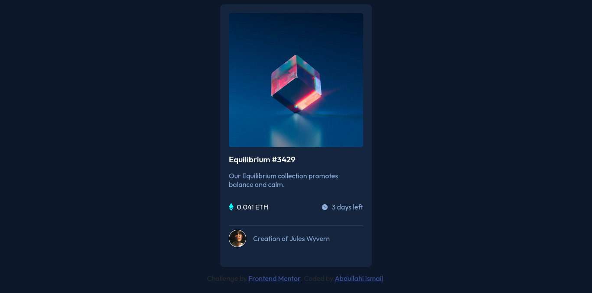

# Frontend Mentor - NFT preview card component solution

This is a solution to the [NFT preview card component challenge on Frontend Mentor](https://www.frontendmentor.io/challenges/nft-preview-card-component-SbdUL_w0U). Frontend Mentor challenges help you improve your coding skills by building realistic projects.

## Table of contents

-   [Overview](#overview)
    -   [The challenge](#the-challenge)
    -   [Screenshot](#screenshot)
    -   [Links](#links)
-   [My process](#my-process)
    -   [Built with](#built-with)
    -   [Useful resources](#useful-resources)
-   [Author](#author)

## Overview

### The challenge

Users should be able to:

-   View the optimal layout depending on their device's screen size
-   See hover states for interactive elements

### Screenshot

### Links

-   Solution URL: [My solution](https://github.com/M1RAK/Frontend-Mentor/tree/main/nft-preview-card-component-main)
-   Live Site URL: [nft-preview-card-component-main](https://courageous-malasada-c282cb.netlify.app/)

## My process

### Built with

-   Semantic HTML5 markup
-   CSS custom properties
-   Flexbox
-   Mobile-first workflow

### Useful resources

-   [How TO-Image Overlay Icon](https://www.w3schools.com/howto/howto_css_image_overlay_title.asp) - This helped me to overlay the icon over the image.

## Author

-   Frontend Mentor - [@M1RAK](https://www.frontendmentor.io/profile/M1RAK)
-   X - [@MEHRAHKII](https://www.x.com/MEHRAHKII)
