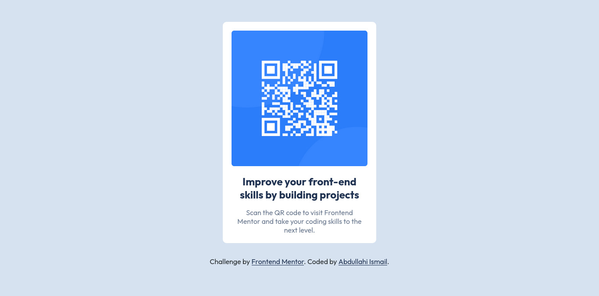

# Frontend Mentor - QR code component solution

This is a solution to the [QR code component challenge on Frontend Mentor](https://www.frontendmentor.io/challenges/qr-code-component-iux_sIO_H). Frontend Mentor challenges help you improve your coding skills by building realistic projects.

## Table of contents

-   [Overview](#overview)
    -   [The challenge](#the-challenge)
    -   [Screenshot](#screenshot)
    -   [Links](#links)
-   [My process](#my-process)
    -   [Built with](#built-with)
-   [Author](#author)

## Overview

### Screenshot

### Links

-   Solution URL: [My solution](https://github.com/M1RAK/Frontend-Mentor/tree/main/qr-code-component-main)
-   Live Site URL: [qr-code-component-main](https://courageous-malasada-c282cb.netlify.app/)

## My process

### Built with

-   Semantic HTML5 markup
-   CSS custom properties
-   Flexbox
-   Mobile-first workflow

## Author

-   Frontend Mentor - [@M1RAK](https://www.frontendmentor.io/profile/M1RAK)
-   X - [@MEHRAHKII](https://www.x.com/MEHRAHKII)
