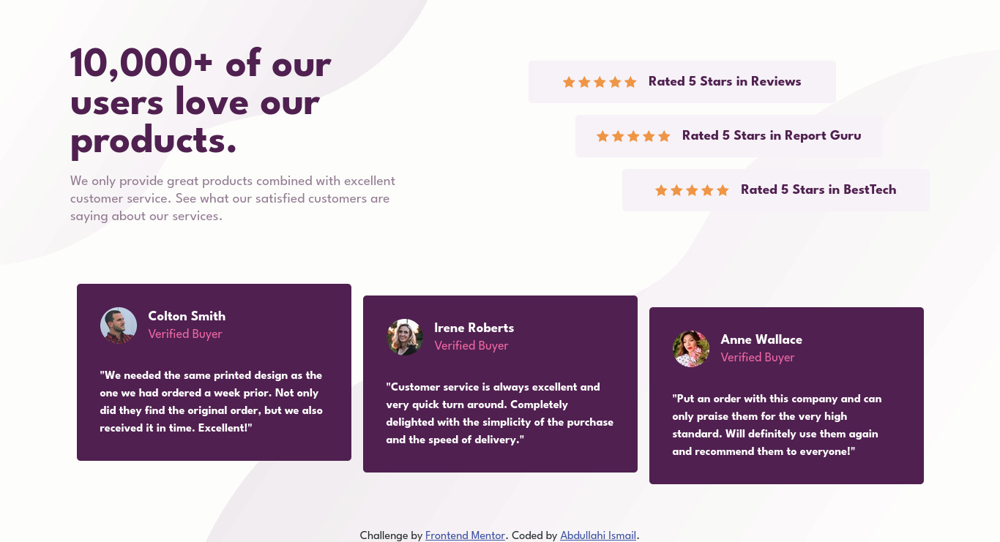

# Frontend Mentor - Social proof section solution

This is a solution to the [Social proof section challenge on Frontend Mentor](https://www.frontendmentor.io/challenges/social-proof-section-6e0qTv_bA). Frontend Mentor challenges help you improve your coding skills by building realistic projects.

## Table of contents

-   [Overview](#overview)
    -   [The challenge](#the-challenge)
    -   [Screenshot](#screenshot)
    -   [Links](#links)
-   [My process](#my-process)
    -   [Built with](#built-with)
    -   [What I learned](#what-i-learned)
-   [Author](#author)

## Overview

### The challenge

Users should be able to:

-   View the optimal layout for the section depending on their device's screen size

### The challenge

-   Build out the project to the designs provided

### Screenshot



### Links

-   Solution URL: [My solution](https://github.com/M1RAK/Frontend-Mentor/tree/main/social-proof-section-master)
-   Live Site URL: [social-proof-section-master](https://effortless-figolla-bfee8f.netlify.app/)

## My process

### Built with

-   Semantic HTML5 markup
-   CSS custom properties
-   Flexbox
-   Mobile-first workflow

### What I learned

-   How to place more than one background image on a layout.

```css
body {
	background-image: url('../images/bg-pattern-top.svg'),
		url('../images/bg-pattern-bottom.svg');
}
```

## Author

-   Frontend Mentor - [@M1RAK](https://www.frontendmentor.io/profile/M1RAK)
-   X - [@MEHRAHKII](https://www.x.com/MEHRAHKII)
